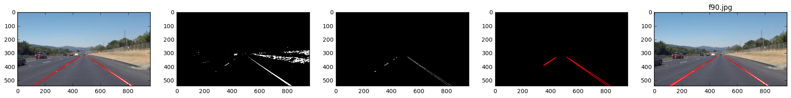

## Finding Lane Lines on the Road 

Overly simple lane line finder. Works on an image/video via a combination of color thresholding, smoothing, and a hough lines transform.

 ideal result

### Summary

The approach I used was to first mask the lanes by color, find edges, clip the frame to triangular road regions, and finally extract the lines. Lines were filtered and segmented into left/right by their slope. To aggregate the lines into one shape for display, I calculated the intercepts along the lower end and averaged them to get left and right points. Since the lanes become very thin in the distance I calculated a third point from the average line at about half the image height, the output was a bounding triangle. In an attempt to make the algorithm more robust I experimented with including a memory so that the pipeline could remember both where the lanes were previously and what had been seen prior. The motion blur effect of using multiple frames resulted in longer lines being detected. The lane memory made the algorithm more robust when no lines could be detected.

### Challenges

 The algorithm is fairly fragile. There are many assumptions about lane color which would fail in different lighting conditions. Also I assumed lanes were always straight and traveling more or less in the direction the car is traveling. This would fail along a curve or during a lange change. The algorithm is also likely to pick up a curb and think it is a lane.

### Future improvements

* Lane detection in the foreground feels like a different problem than in the distance. I think the foreground could be processed with different parameters than the background and better results might be achieved.
* Different lighting conditions and road colors require different parameters, some method could be created to dynamically set these parameters. For example if the whole image is very bright then the white-lane color range parameters could be set to a stricter value.
* Lane and/or image memory should be used. Under normal and most driving conditions lanes are likely to more or less be in the same place, this information should be used.
* Sanity checks and realistic bounds for what the algorithm returns would help. For example sometimes the algorithm returns a very wide lane line which makes no sense, a simple heuristic like "lane markers in the foreground cannot be larger than 50 pixels" could have helped with that.

I spent way too much time tuning parameters without an objective measure of "lane detection quality". If I were to attempt this again I would generate a few manual ground truth lane markings in photoshop or paint. Had I done that at the start I would have likely saved a lot of time adjusting parameters.

